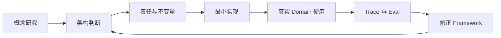

# Thinking in Agent Runtime

> Agent Runtime / Agent Infra 的知识体系、思考框架与工程实践

## 这套系列解决什么问题

这不是一组以发布为终点的文章，而是一套用于长期研究 Agent Runtime 的可演进知识体系。

它希望持续回答三个问题：

1. Agent Runtime 在 AI 生态中属于哪一层，上游、下游和相邻系统分别是什么？
2. 如何把概率性的模型能力变成可运行、可恢复、可观测、可评测、可治理的工程系统？
3. 如何通过 `llm-wiki-runtime` 以及未来的 Loop、State、Trace、Eval Runtime 实践，验证并修正前面的架构判断？

## North Star

> 建立一套能够解释、设计、实现和验证 Agent Runtime 的统一框架，并通过真实 Runtime 项目持续修正它。

这套统一框架还需要一个跨能力域的综合验证目标。当前提出的目标之一是：当 Domain Skill、Domain Harness 与 Loop、State、Knowledge、Tool、Policy、Trace、Eval 等 Runtime 能力形成受治理闭环时，一个具体 Domain workload 是否能够逐步成为持久、可恢复、可评测的 Vertical Domain Agent。它是全书需要长期验证的下游架构假设，不是 Agent Runtime 的唯一目的，也不是当前项目已经完成的事实。

这套体系不以“覆盖更多名词”为目标，而以形成以下闭环为目标：

## 系列结构

### 理论与框架

| 编号 | 文章 | 状态 |
| --- | --- | --- |
| 01 | [总览：我们研究的 Agent Runtime 到底是什么](articles/01-overview.md) | 初稿 |
| 02 | [为什么要用 Runtime 思维看 Agent](articles/02-why-runtime-thinking.md) | 临时研究骨架，尚未共同写作 |
| 03 | [Runtime 的历史与 Agent Runtime 的当前定义](articles/03-runtime-history-and-definition.md) | 临时研究骨架，尚未共同写作 |
| 04 | [Agent Runtime 在 AI 生态中的坐标](articles/04-agent-runtime-ecosystem.md) | 临时研究骨架，尚未共同写作 |
| 05 | [Agent Runtime Thinking Framework](articles/05-agent-runtime-thinking-framework.md) | 临时研究骨架，尚未共同写作 |
| 06 | [Agent Runtime 能力框架](articles/06-agent-runtime-capability-framework.md) | 临时研究骨架，尚未共同写作 |
| 07 | Loop Runtime：Agent 如何持续执行 | 尚未创建 |
| 08 | State & Workflow Runtime：如何暂停、恢复和完成长任务 | 尚未创建 |
| 09 | Knowledge & Context Runtime：Agent 如何获得可信知识 | 尚未创建 |
| 10 | Tools、MCP 与治理：Agent 如何安全作用于外部世界 | 尚未创建 |
| 11 | Trace Runtime：如何看见 Agent 做了什么 | 尚未创建 |
| 12 | Eval Runtime：如何判断 Agent 是否真的变好 | 尚未创建 |

### 实践与反向印证

| 编号 | 文章 | 状态 |
| --- | --- | --- |
| 13 | `llm-wiki-runtime`：Knowledge & Context Runtime 的实践印证 | 已有实践，尚未创建文章 |
| 14 | Loop Runtime 实践：从最小循环到可控执行 | 预留研究章 |
| 15 | State & Workflow Runtime 实践：Checkpoint 与长任务恢复 | 预留研究章 |
| 16 | Tool Gateway、MCP 与 Policy 实践 | 预留研究章 |
| 17 | Trace Runtime 实践：让 Agent Run 可以解释和重放 | 预留研究章 |
| 18 | Eval Runtime 实践：从 Bad Case 到持续评测 | 预留研究章 |
| 19 | 集成实践：从多个 Runtime 到 Agent Infra | 预留研究章 |
| 20 | [从 Domain Workload 走向 Vertical Domain Agent](articles/20-domain-workloads-to-vertical-agents.md) | 研究骨架，综合验证目标 |

## 理论与实践如何互相印证

| 实践文章 | 主要验证的理论文章 |
| --- | --- |
| 13 `llm-wiki-runtime` | 02、05、06、09，并为 10、11、12 提供接口问题 |
| 14 Loop Runtime 实践 | 05、06、07 |
| 15 State & Workflow Runtime 实践 | 05、06、08 |
| 16 Tool / MCP / Policy 实践 | 04、06、10 |
| 17 Trace Runtime 实践 | 06、07、08、09、10、11 |
| 18 Eval Runtime 实践 | 06、11、12 |
| 19 集成实践 | 01、04、05、06 以及全部领域章节 |
| 20 Vertical Domain Agent 综合章 | 04—12 的能力框架，以及 13—19 的实践证据 |

实践章节不只是介绍代码。它必须回答：

- 哪个理论判断得到了验证？
- 哪个判断在实现中被修正？
- 哪些能力属于当前 Runtime，哪些应交给相邻 Runtime？
- 产生了什么可以复查的证据？
- 这些证据是否足以推动总体 Framework 演进？

## 章节成熟度

- **研究骨架**：核心问题和论证结构已经确定，事实与案例仍需补充。
- **初稿**：已经形成完整论证，可以继续校准事实、图示和表达。
- **已有实践，待成文**：实现与证据已经存在，需要按理论映射重新组织。
- **预留研究章**：只固定研究问题、最小实现和验收证据，不宣称能力已经实现。
- **已验证**：文章判断已经由源码、测试、运行记录或真实 Domain 使用支持。

## 当前研究位置

当前已经具备较成熟实践的是 Knowledge & Context Runtime，具体项目为
[`llm-wiki-runtime`](https://github.com/huajiexiewenfeng/llm-wiki-runtime)。

它验证了 local-first、deterministic、安全读写、来源追溯、Context Pack、精确记录检索和证据图谱等能力，但没有实现完整 Agent Loop、Run Checkpoint、Trace Runtime、Eval Runtime 或云端 Agent Infra。

后续研究应当从真实问题出发，逐步补齐 Loop、State、Tool、Trace、Eval 与治理能力，而不是把所有名词一次性塞进同一个项目。
