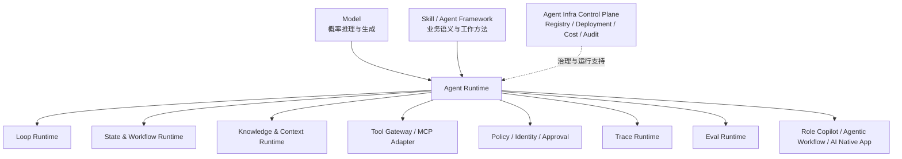

# 总览：我们研究的 Agent Runtime 到底是什么

## 从一个越来越清晰的问题开始

最初研究 RAG、Agent、Skill、MCP 或 Agent Framework 时，很容易把注意力放在模型能做什么：它能不能调用工具，能不能读取知识，能不能拆解任务，能不能连续运行很多轮。

但当 Agent 开始进入真实工作，问题会迅速发生变化：

- 一项任务执行到一半中断了，怎样继续？
- 模型调用了一个有副作用的工具，谁负责审批和幂等？
- 上一次产生的知识怎样安全保存，并在下一次任务中准确取回？
- 一次错误来自模型、知识、工具、状态，还是策略？
- 系统怎样证明它真的变好了，而不是偶尔表现得更好？
- 当模型、工具和框架都可以替换时，哪些能力必须长期稳定？

这些问题已经不再是“Prompt 写得好不好”，也不只是“选择哪个 Agent 框架”。它们共同指向一层新的工程对象：Agent Runtime。

## 一句话定义

在这套知识体系中，Agent Runtime 暂时定义为：

> Agent Runtime 是位于概率模型与真实业务世界之间，负责 Agent 执行生命周期、状态连续性、知识上下文、工具接入、安全策略、可观测性和评测接口的运行底座。

这个定义有意强调“责任”，而不是某种具体产品形态。

Agent Runtime 可以由一个库实现，也可以由多个进程或服务协作完成；可以使用 CLI、API 或 MCP 暴露能力；可以本地运行，也可以部署在云端。判断它是不是 Runtime，不看名字，而看它是否承担了 Agent 运行过程中不可缺失的工程责任。

## Runtime 不负责让模型更聪明

模型负责概率性的理解、生成、判断和规划。Runtime 的主要价值不是替代这些智能，而是为它建立确定性边界。

```text
模型擅长：
理解意图、生成方案、做非确定性判断、选择下一步

Runtime 擅长：
保存状态、校验权限、控制副作用、记录证据、处理失败、恢复执行
```

因此，本系列的核心判断不是“未来所有东西都应该叫 Runtime”，而是：

> 概率性的智能需要确定性的基础设施，才能成为可以长期运行的系统。

## Agent Runtime 与 Agent Infra

Agent Runtime 和 Agent Infra 不是两个互斥概念，而是包含关系。

Agent Runtime 更靠近一次真实的 Agent Run，直接参与执行：

- Loop
- Run State
- Checkpoint
- Knowledge Context
- Tool Invocation
- Policy Enforcement
- Online Trace
- Online Eval

Agent Infra 的范围更大，还包括不一定处于每次执行关键路径上的平台能力：

- Agent、Skill、Tool Registry
- Runtime Deployment
- Scheduling
- Multi-Tenancy
- Identity 与 Secrets
- Trace Storage
- Offline Eval
- Cost 与 Audit
- Version 与 Migration

因此，这套研究的总方向可以称为 Agent Infra，核心研究对象是 Agent Runtime。

## 一张总体能力地图



这张图表达的是责任关系，不是固定的网络调用拓扑。比如 Trace 采集可能嵌入 Loop，Trace Storage 则属于外部平台；Eval 可以在执行中在线拦截，也可以在执行后离线回归。

## 七个需要持续研究的能力域

### Loop Runtime

Loop Runtime 回答：Agent 怎样从一次模型调用变成持续执行过程？

它关心 Model Turn、Tool Call、Handoff、退出条件、最大轮次和错误反馈，是 Agent Runtime 最靠近推理循环的核心。

### State & Workflow Runtime

State Runtime 回答：Agent 如何知道自己做到哪里，并在中断后继续？

它关心 Run、Thread、Task、Workflow State、Checkpoint、Pause、Resume、Retry、Idempotency 和 Failure Recovery。

### Knowledge & Context Runtime

Knowledge Runtime 回答：什么知识值得长期保存，本次任务应该给模型哪些上下文？

它关心 Source、Record、Artifact、Provenance、Citation、Retrieval、Context Pack、Knowledge Graph 和 Knowledge Lifecycle。

### Tool Gateway 与 MCP

Tool Gateway 回答：Agent 怎样以可验证、可授权的方式作用于外部世界？

MCP 可以标准化 Tools、Resources、Prompts 以及客户端与服务端的交互，但不会自动拥有完整 Agent Run 的目标、Checkpoint、恢复和治理状态。

### Policy、Identity 与 Approval

这一能力域回答：谁可以做什么，哪些动作必须经过确认，失败后怎样回滚？

它关心 Identity、Permission、Risk Level、Approval、Default Deny、Secrets、Rollback 和 Audit Event。

### Trace Runtime

Trace Runtime 回答：一次 Agent Run 中到底发生了什么？

它需要连接 Model、Tool、Knowledge、State 和 Approval 事件，让一次运行能够被解释、定位和比较。

### Eval Runtime

Eval Runtime 回答：怎样判断 Agent 真的变好，以及问题究竟属于哪一层？

它关心 Eval Case、Dataset、Rule Judge、Human Judge、LLM Judge、Golden Trace、Regression、Bad Case 和 Continuous Evaluation。

## 为什么需要 Thinking Framework

仅仅列出七个 Runtime 仍然不够。技术生态会不断出现新的名词、协议和产品，如果没有稳定的分析方法，知识体系会重新退化成功能清单。

因此，本系列将使用一组长期问题分析任何 Agent 系统：

1. 谁拥有业务语义？
2. 谁控制执行循环？
3. Knowledge、Context、Memory 与 State 分别在哪里？
4. 哪些行为可以交给模型，哪些必须由代码保证？
5. 工具通过什么合同接入？
6. 失败后怎样重试、暂停和恢复？
7. 行为怎样被 Trace？
8. 结果怎样被 Eval？
9. 权限与审批由谁控制？
10. 模块如何替换和演进？

这些问题共同构成后续的 [Agent Runtime Thinking Framework](05-agent-runtime-thinking-framework.md)。

## 当前实践：从 Knowledge Runtime 切入

这套研究并不是从零开始。

当前已经存在的 [`llm-wiki-runtime`](https://github.com/huajiexiewenfeng/llm-wiki-runtime)，可以被定位为一个 local-first、deterministic 的 Knowledge & Context Runtime：

- `local-first`：知识默认由用户本地或项目 Scope 持有，云端不是运行前提。
- `deterministic`：路径、权限、写入模式、锁、Checksum、引用和返回状态由确定性代码控制。
- `Knowledge`：长期保存来源、记录、Artifact、日志和证据关系。
- `Context`：针对当前任务生成经过过滤、授权、限量并带引用的 Context Pack。

它已经证明了一部分 Runtime 判断：

- Domain Skill 应拥有业务语义，Runtime 应拥有可靠访问机制。
- 模型可以决定“什么值得保存”，但不能自行保证路径安全、原子写和幂等。
- 知识与来源必须能够被追溯，而不是只把一段文本塞回 Prompt。
- Runtime 不可用时，上层业务 Skill 应有明确降级路径。

同时，它也清楚暴露了尚未解决的问题：

- 没有通用 Agent Loop。
- 没有 Run State 与 Checkpoint。
- 没有完整 Trace Runtime。
- 没有 Eval Runtime。
- 没有 MCP 服务形态。
- 没有云端、多租户或统一控制面。

因此，`llm-wiki-runtime` 不是完整 Agent Runtime 的证明，而是 Knowledge & Context Runtime 这一层的第一份工程证据。

## 理论与实践必须双向流动

从第 13 篇开始，本系列进入实践印证部分。实践文章不会只介绍功能，而会使用统一结构：

```text
理论判断
→ Runtime 责任边界
→ 最小实现
→ 真实运行证据
→ 失败与偏差
→ 对理论的修正
→ 对相邻 Runtime 的接口需求
```

例如，`llm-wiki-runtime` 会反向验证 Knowledge、Context、State 的边界；未来 Trace Runtime 会验证什么信息必须在执行时采集；Eval Runtime 会验证现有 Trace 是否足以判断质量变化。

这意味着理论文章也不是一次写死的。只要实践证据推翻了原有判断，就应该修正 Framework，而不是为了维护文章结论去解释现实。

## 这套系列最终希望得到什么

它最终不只是 19 篇文章，而应沉淀为四类长期资产：

1. **统一术语**：让 Model、Skill、Runtime、MCP、Tool、Knowledge、State、Trace、Eval 不再混用。
2. **参考架构**：能够描述完整 Agent Runtime，也能容纳不同实现。
3. **工程方法**：从责任、不变量、失败和证据出发设计 Runtime。
4. **实践资产**：Knowledge、Loop、State、Trace、Eval 等可运行模块和真实验证记录。

真正的目标不是证明我们已经拥有完整答案，而是建立一种可以持续提出正确问题、做出最小实现并用证据修正自己的研究方式。

## 阅读路径

第一次阅读建议按编号顺序：

```text
总览
→ 为什么需要 Runtime 思维
→ 历史与定义
→ 生态坐标
→ Thinking Framework
→ 能力框架
→ 各领域理论
→ 各领域实践
```

如果正在解决具体工程问题，可以从能力域直接进入：

- 长任务中断与恢复：阅读 State & Workflow Runtime。
- 知识、引用和 Context：阅读 Knowledge & Context Runtime。
- 工具安全与 MCP：阅读 Tools、MCP 与治理。
- 定位一次 Agent 失败：阅读 Trace Runtime。
- 判断版本是否变好：阅读 Eval Runtime。

下一篇将从最根本的问题开始：[为什么要用 Runtime 思维看 Agent](02-why-runtime-thinking.md)。
